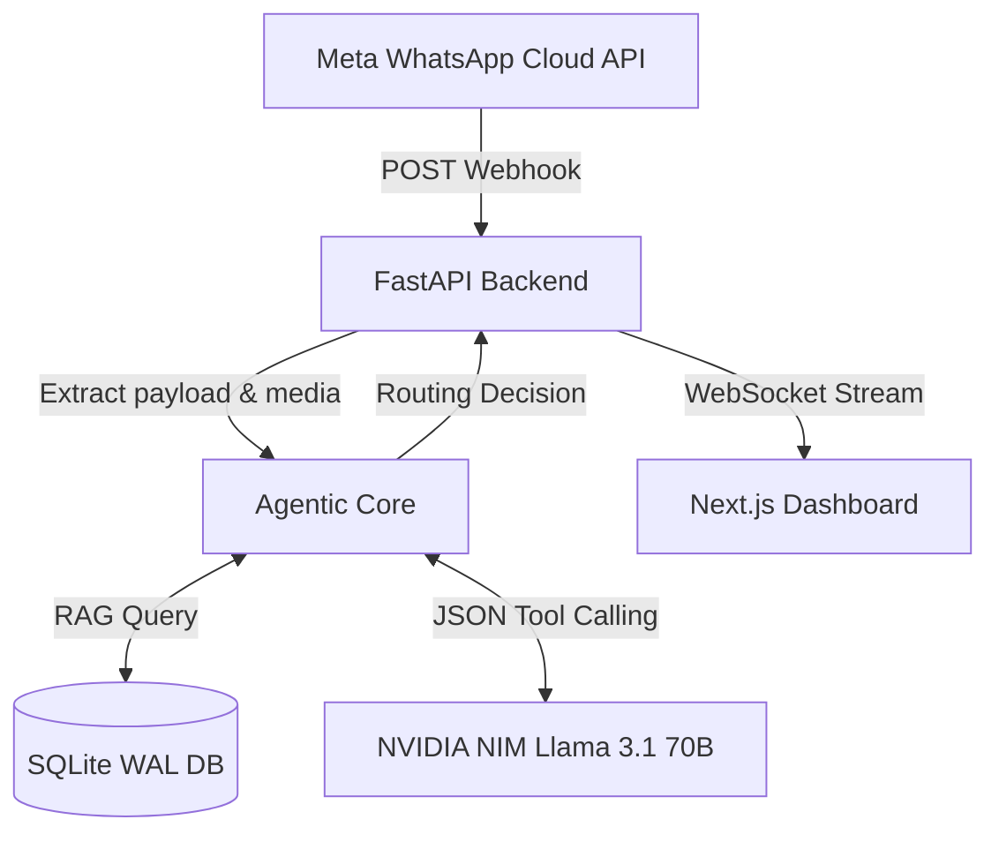

# Agentic WhatsApp Notification Router 🧠📱

An intelligent, autonomous AI routing system that acts as a "smart bouncer" for your WhatsApp notifications. Built with **Llama 3.1 70B**, **FastAPI**, and **Next.js**, this system ingests incoming Meta Webhooks, analyzes the context of each message against historical communication patterns (RAG), and dynamically decides whether to instantly notify you, silently digest it for later, or completely mute the sender.

## ✨ Key Features

- **Agentic Decision Engine:** Uses NVIDIA NIM (`meta/llama-3.1-70b-instruct`) to autonomously reason about incoming messages based on urgency, relationship context, and user Do-Not-Disturb preferences.
- **Real-Time Live Monitor:** A gorgeous, responsive Next.js dashboard featuring WebSockets to stream the LLM's thought process (Reasoning Timeline) in real-time.
- **Multimodal Support:** Automatically parses text, images, and voice notes straight from Meta's webhook payloads.
- **Historical Context (RAG):** Uses BM25 search over a SQLite database to retrieve past interactions with the sender before making a routing decision.
- **High-Concurrency Database:** Uses SQLite with WAL (Write-Ahead Logging) mode to safely handle bursty, high-volume concurrent webhooks from Meta without locking.
- **Fallback Deterministic Evaluation:** Implements safety gates (Regex and hardcoded rules) to ensure critical alerts are never missed even if the LLM hallucinated.

## 🏗️ Architecture



## 🛠️ Tech Stack

**Backend:** Python, FastAPI, SQLAlchemy, SQLite, WebSockets, BM25  
**Frontend:** Next.js (App Router), React, Tailwind CSS v4, Framer Motion, Lucide Icons  
**AI / ML:** Llama 3.1 70B (via NVIDIA NIM)  

## 🚀 Getting Started

### 1. Backend Setup (FastAPI)
Navigate to the root directory and install dependencies:
```bash
pip install -r requirements.txt
```
Create a `.env` file in the root directory:
```env
NVIDIA_API_KEY=your_nvidia_nim_key
META_VERIFY_TOKEN=my_secret_token_123
```
Run the FastAPI server:
```bash
uvicorn code.api.main:app --host 0.0.0.0 --port 8000 --reload
```

### 2. Frontend Setup (Next.js)
Navigate to the `frontend` directory:
```bash
cd frontend
npm install
```
Create a `.env.local` file in the frontend directory:
```env
NEXT_PUBLIC_API_URL=http://localhost:8000
```
Run the development server:
```bash
npm run dev
```

### 3. Meta Webhook Configuration
1. Go to the Meta Developer Portal and create a WhatsApp Business App.
2. In the **WhatsApp > Configuration** menu, set the webhook URL to your backend endpoint (e.g., `https://your-domain.com/webhook/whatsapp`).
3. Use the `META_VERIFY_TOKEN` you set in your `.env`.
4. Subscribe to the `messages` field.

## 📂 Project Structure

- `/code/api/main.py`: FastAPI server, WebSockets, and Meta webhook parsers.
- `/code/agent/core.py`: The autonomous LLM routing engine and multi-turn tool executor.
- `/code/db/`: SQLAlchemy models and SQLite connection pooling logic.
- `/code/tools/`: RAG retrieval, audio transcription, and image analysis tools.
- `/frontend/`: The Next.js React application.

## 🤝 Contributing
Contributions, issues, and feature requests are welcome! Feel free to check the issues page.

---
*Designed for high-signal, low-noise communication.*
